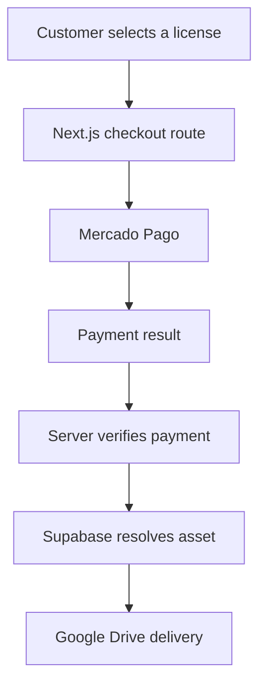

# Notype Labs

A full-stack beat store for browsing, previewing and purchasing music licenses online.

Notype Labs started as a personal music project and evolved into a deployed product that combines audio playback, content management, payments and protected digital delivery in a single web application.

**Live site:** [notypelabs.vercel.app](https://notypelabs.vercel.app/)

> **Project status:** Deployed and functional portfolio product. Core catalog, administration, checkout and download flows are implemented. Automated testing, CI and additional production hardening remain part of the roadmap.

## Product overview

Notype Labs allows artists to:

- Browse a catalog of original beats
- Preview tracks through a persistent audio player
- Explore beat information such as BPM, musical key and mood
- Choose between different license tiers
- Complete a purchase through Mercado Pago
- Download the corresponding digital asset after payment verification

The application also includes a restricted administration area for managing the catalog and its public assets.

## Core features

### Storefront

- Responsive beat catalog
- Dynamic pages for individual beats
- Persistent audio playback across the application
- Beat metadata including BPM, key, mood and price
- License selection and tier-based pricing
- Sold-status handling
- Spanish-language storefront and legal pages
- Sitemap, robots configuration and social preview assets

### Administration

- Authentication with Supabase Auth
- Restricted administration dashboard
- Beat creation and catalog listing
- MP3 preview and cover-image uploads
- File-size validation
- Automatic slug generation
- Duplicate-slug validation
- Beat deletion from both the database and storage
- Sold-status management

### Payments and delivery

- Mercado Pago Payment Brick integration
- Wallet and card payment flows
- Server-side price calculation based on the stored beat
- Payment metadata linking a purchase to a beat and license
- Mercado Pago webhook endpoint
- Payment-status verification before download
- License-aware delivery of MP3, WAV or ZIP assets
- Google Drive integration using a service account
- Supabase mapping between beats and downloadable assets

## Purchase and delivery flow



A download request is not authorized solely because the user reaches the success page. The backend retrieves the payment from Mercado Pago and confirms that its status is approved before resolving and returning the purchased asset.

## Technology stack

### Application

- Next.js 16
- React 19
- TypeScript
- Tailwind CSS

### Data and authentication

- Supabase Database
- Supabase Auth
- Supabase Storage

### Integrations

- Mercado Pago SDK and Payment Brick
- Google Drive API
- Vercel deployment

### Audio

- WaveSurfer.js
- Shared React audio context

## Architecture

Notype Labs uses the Next.js App Router and combines server-side API routes with client-side storefront and administration interfaces.

```text
app/
├── admin/                         # Authentication and catalog management
├── api/
│   ├── checkout/                  # Mercado Pago preference and payment creation
│   ├── download/                  # Verified digital delivery
│   └── webhooks/mercadopago/      # Payment notifications
├── beats/                         # Catalog and dynamic beat pages
├── success/                       # Post-payment experience
└── legal and contact pages

components/                        # Storefront, modal and audio UI
lib/                               # Supabase client and shared integrations
public/                            # Static media and metadata assets
```

## Data responsibilities

The current application uses:

- A `beats` table for catalog and commercial metadata
- A `beat_assets` table for license-specific Google Drive file references
- A `beats-assets` Supabase Storage bucket for public previews and covers
- Mercado Pago metadata to preserve the relationship between payment, beat and license

Database schema and security policies are managed outside this repository and must be configured separately.

## Local development

### Requirements

- Node.js 20 or later
- npm
- Supabase project
- Mercado Pago application
- Google Cloud service account with read access to the delivery files

### Installation

```bash
git clone https://github.com/jireyes94/notype-labs.git
cd notype-labs
npm install
```

Create a local `.env.local` file with the required configuration:

```env
NEXT_PUBLIC_SUPABASE_URL=
NEXT_PUBLIC_SUPABASE_ANON_KEY=
NEXT_PUBLIC_MP_PUBLIC_KEY=
NEXT_PUBLIC_URL=http://localhost:3000

MERCADOPAGO_ACCESS_TOKEN=
GOOGLE_SERVICE_ACCOUNT_JSON=
```

Do not commit real credentials or service-account data.

Start the development server:

```bash
npm run dev
```

Open [http://localhost:3000](http://localhost:3000).

## Available scripts

```bash
npm run dev
npm run build
npm run start
npm run lint
```

## Known limitations

The current version should be understood as a functional product and portfolio implementation, not as a fully hardened e-commerce platform.

Current technical limitations include:

- No automated unit, integration or end-to-end test suite
- No continuous integration pipeline
- Limited webhook processing beyond payment verification and logging
- No automated email-delivery workflow
- No documented database migrations or reproducible schema setup
- Administration security depends on external Supabase configuration and policies
- Limited observability and structured error reporting
- Some frontend and API types still require stricter validation

These limitations are documented intentionally and define the next engineering stage of the project.

## Roadmap

- [x] Build the responsive storefront
- [x] Add persistent audio playback
- [x] Integrate Supabase catalog, authentication and storage
- [x] Build the administration dashboard
- [x] Integrate Mercado Pago checkout
- [x] Verify approved payments before digital delivery
- [x] Deliver license-specific assets from Google Drive
- [x] Add legal and contact pages
- [ ] Add reproducible database migrations and seed data
- [ ] Introduce schema validation for API inputs
- [ ] Add unit and integration tests
- [ ] Add Playwright end-to-end purchase scenarios
- [ ] Configure GitHub Actions
- [ ] Harden webhook validation and idempotency
- [ ] Improve server-side administration authorization
- [ ] Add structured logging and production monitoring
- [ ] Automate transactional email delivery

## What this project demonstrates

- Building and deploying a full-stack product
- Integrating external payment and storage services
- Designing a multi-step purchase workflow
- Protecting digital delivery through server-side verification
- Managing authenticated and public application areas
- Connecting product requirements with practical implementation decisions
- Iterating through feature branches and pull requests

## Author

**José Ignacio Reyes Lima**

Music producer and QA Engineer focused on automation and software development.

- [GitHub](https://github.com/jireyes94)
- [LinkedIn](https://www.linkedin.com/in/ignacio-reyes-lima/)
