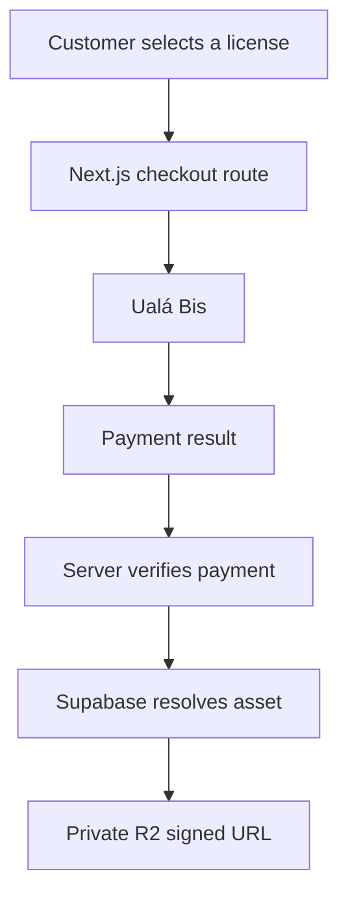

# Notype Labs

A full-stack beat store for browsing, previewing and purchasing music licenses online.

Notype Labs started as a personal music project and evolved into a deployed product that combines audio playback, content management, payments and protected digital delivery in a single web application.

**Live site:** [notypelabs.vercel.app](https://notypelabs.vercel.app/)

> **Project status:** Deployed and functional portfolio product. Core catalog, administration, checkout and download flows are implemented. Automated testing, CI and additional production hardening remain part of the roadmap.

## Product overview

Notype Labs allows artists to:

- Browse a catalog of original beats
- Preview tracks through a persistent audio player
- Explore beat information such as BPM, musical key and mood
- Choose between different license tiers
- Complete a purchase through Ualá Bis
- Download the corresponding digital asset after payment verification

The application also includes a restricted administration area for managing the catalog and its public assets.

## Core features

### Storefront

- Responsive beat catalog
- Dynamic pages for individual beats
- Persistent audio playback across the application
- Beat metadata including BPM, key, mood and price
- License selection and tier-based pricing
- Sold-status handling
- Spanish-language storefront and legal pages
- Sitemap, robots configuration and social preview assets

### Administration

- Authentication with Supabase Auth
- Restricted administration dashboard
- Beat creation and catalog listing
- Direct MP3 preview and cover-image uploads
- Direct private MP3, WAV and Unlimited ZIP uploads to Cloudflare R2
- Server-side administrator authorization for every catalog mutation
- File-size validation
- Automatic slug generation
- Duplicate-slug validation
- Beat deletion from both the database and storage
- Sold-status management

### Payments and delivery

- Ualá Bis hosted checkout integration
- Card payment flow in a separate secure tab
- Server-side price calculation based on the stored beat
- Private order snapshots linking each purchase to its beat and license
- Idempotent Ualá webhook processing
- Automatic payment-status reconciliation before download
- License-aware delivery of MP3, WAV or ZIP assets
- Expiring, limited download entitlements stored as token hashes
- Direct private delivery from Cloudflare R2 through short-lived signed URLs
- Supabase mapping between beats and R2 object keys

## Purchase and delivery flow



A download request is not authorized solely because the user reaches the success page. The backend reconciles the Ualá order, treats Ualá's `PROCESSED` customer-charge status (and the later `APPROVED` disbursement status) as paid, and atomically consumes an expiring download entitlement before issuing a five-minute R2 URL.

## Technology stack

### Application

- Next.js 16
- React 19
- TypeScript
- Tailwind CSS

### Data and authentication

- Supabase Database
- Supabase Auth
- Supabase Storage

### Integrations

- Ualá Bis API v2
- Cloudflare R2 S3-compatible API
- Google Drive API for offline migration tooling only
- Vercel deployment

### Audio

- WaveSurfer.js
- Shared React audio context

## Architecture

Notype Labs uses the Next.js App Router and combines server-side API routes with client-side storefront and administration interfaces.

```text
app/
├── admin/                         # Authentication and catalog management
├── api/
│   ├── checkout/                  # Ualá order and hosted-checkout creation
│   ├── download/                  # Verified digital delivery
│   └── webhooks/uala/             # Payment notifications
├── beats/                         # Catalog and dynamic beat pages
├── success/                       # Post-payment experience
└── legal and contact pages

components/                        # Storefront, modal and audio UI
lib/                               # Supabase client and shared integrations
public/                            # Static media and metadata assets
```

## Data responsibilities

The current application uses:

- A `beats` table for catalog and commercial metadata
- A `beat_assets` table for license-specific private R2 object keys
- A `beats-assets` Supabase Storage bucket for public previews and covers
- Private order, item, payment-event and download-entitlement tables

Reproducible database migrations and security policies live in `supabase/migrations`.

## Local development

### Requirements

- Node.js 20 or later
- npm
- Supabase project
- Ualá Bis API v2 credentials
- Private Cloudflare R2 bucket and read-only S3 credentials
- Google Cloud service account only when running the legacy Drive migration tools

### Installation

```bash
git clone https://github.com/jireyes94/notype-labs.git
cd notype-labs
npm install
```

Create a local `.env.local` file with the required configuration:

```env
NEXT_PUBLIC_SUPABASE_URL=
NEXT_PUBLIC_SUPABASE_ANON_KEY=
NEXT_PUBLIC_URL=http://localhost:3000
NEXT_PUBLIC_GA_MEASUREMENT_ID=

SUPABASE_SERVICE_ROLE_KEY=
UALA_ENVIRONMENT=test
UALA_USERNAME=
UALA_CLIENT_ID=
UALA_CLIENT_SECRET_ID=
R2_ACCOUNT_ID=
R2_BUCKET_NAME=notype-labs-assets
R2_ACCESS_KEY_ID=
R2_SECRET_ACCESS_KEY=
R2_ADMIN_ACCESS_KEY_ID=
R2_ADMIN_SECRET_ACCESS_KEY=
DOWNLOAD_TOKEN_SECRET=
ADMIN_USER_ID=

# Offline asset audit/migration only
GOOGLE_SERVICE_ACCOUNT_JSON=
```

Do not commit real credentials or service-account data.

`R2_ACCESS_KEY_ID` and `R2_SECRET_ACCESS_KEY` are read-only delivery credentials. The separate `R2_ADMIN_*` pair must be scoped to the assets bucket with object read/write access and is used only to create short-lived upload URLs, verify new objects and remove assets from deleted beats.

Browser uploads through presigned R2 URLs require this bucket CORS policy (add the final production origin and localhost; do not include a trailing slash):

```json
[
  {
    "AllowedOrigins": [
      "http://localhost:3000",
      "https://notypelabs.vercel.app"
    ],
    "AllowedMethods": ["PUT"],
    "AllowedHeaders": ["Content-Type"],
    "ExposeHeaders": ["ETag"],
    "MaxAgeSeconds": 3600
  }
]
```

`NEXT_PUBLIC_GA_MEASUREMENT_ID` is optional. When it contains a GA4 measurement ID, the storefront reports page views, Core Web Vitals and the commercial events `play_start`, `select_item`, `view_license_options`, `begin_checkout`, `purchase`, `file_download` and `search`. Without it, analytics code remains inactive.

Start the development server:

```bash
npm run dev
```

Open [http://localhost:3000](http://localhost:3000).

## Available scripts

```bash
npm run dev
npm run build
npm run start
npm run lint
npm run check:integrations
npm run check:asset-sizes
npm run migrate:assets:r2
```

## Known limitations

The current version should be understood as a functional product and portfolio implementation, not as a fully hardened e-commerce platform.

Current technical limitations include:

- No automated unit, integration or end-to-end test suite
- No continuous integration pipeline
- No automated email-delivery workflow
- Administration security depends on external Supabase configuration and policies
- Limited observability and structured error reporting
- Some frontend and API types still require stricter validation

These limitations are documented intentionally and define the next engineering stage of the project.

## Roadmap

- [x] Build the responsive storefront
- [x] Add persistent audio playback
- [x] Integrate Supabase catalog, authentication and storage
- [x] Build the administration dashboard
- [x] Integrate Ualá Bis v2 hosted checkout
- [x] Verify approved payments before digital delivery
- [x] Deliver license-specific assets privately from Cloudflare R2
- [x] Add reproducible order and download database migrations
- [x] Add legal and contact pages
- [ ] Add catalog seed data
- [ ] Introduce schema validation for API inputs
- [ ] Add unit and integration tests
- [ ] Add Playwright end-to-end purchase scenarios
- [ ] Configure GitHub Actions
- [ ] Harden webhook validation and idempotency
- [ ] Improve server-side administration authorization
- [ ] Add structured logging and production monitoring
- [ ] Automate transactional email delivery

## What this project demonstrates

- Building and deploying a full-stack product
- Integrating external payment and storage services
- Designing a multi-step purchase workflow
- Protecting digital delivery through server-side verification
- Managing authenticated and public application areas
- Connecting product requirements with practical implementation decisions
- Iterating through feature branches and pull requests

## Author

**José Ignacio Reyes Lima**

Music producer and QA Engineer focused on automation and software development.

- [GitHub](https://github.com/jireyes94)
- [LinkedIn](https://www.linkedin.com/in/ignacio-reyes-lima/)
